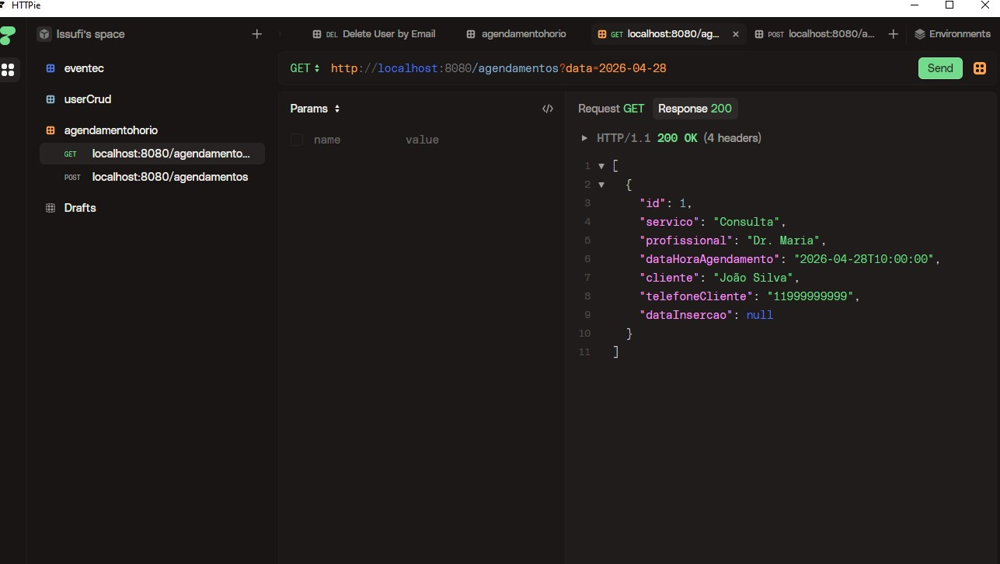
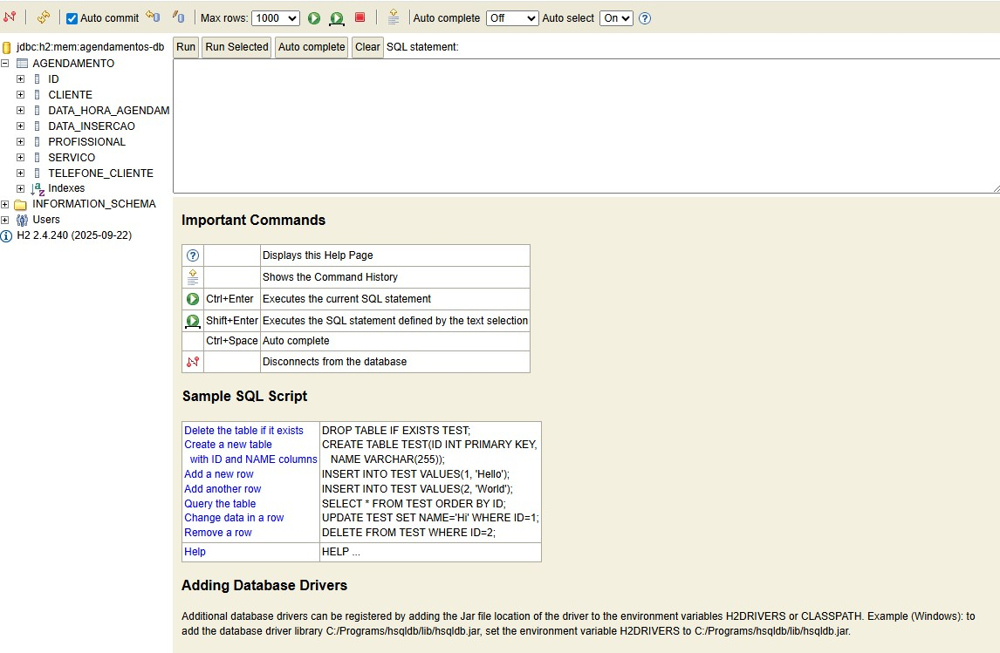

# Agendador de Horários

API REST para gerenciamento de agendamentos de horários, desenvolvida com Spring Boot 4 e banco de dados H2 em memória.

## Tecnologias

- Java 25
- Spring Boot 4.0.6
- Spring Data JPA + Hibernate
- H2 Database (em memória)
- Lombok
- SpringDoc OpenAPI 3.0.3 (Swagger UI)

## Funcionalidades

- Criar agendamento com verificação de conflito de horário (janela de 1 minuto por serviço)
- Listar todos os agendamentos de um dia
- Atualizar dados de um agendamento existente
- Excluir agendamento por cliente e data/hora

## Endpoints da API

| Método | Rota            | Descrição                                   |
|--------|-----------------|---------------------------------------------|
| POST   | `/agendamentos` | Cria um novo agendamento                    |
| GET    | `/agendamentos?data={LocalDate}` | Lista agendamentos do dia   |
| PUT    | `/agendamentos?cliente={}&dataHoraAgendamento={}` | Atualiza agendamento |
| DELETE | `/agendamentos?cliente={}&dataHoraAgendamento={}` | Remove agendamento   |

## Como executar

```bash
./mvnw clean spring-boot:run
```

## Acessos

| Recurso        | URL                                      |
|----------------|------------------------------------------|
| API            | http://localhost:8080/agendamentos        |
| Swagger UI     | http://localhost:8080/swagger-ui.html     |
| H2 Console     | http://localhost:8080/h2-console          |

### Configuração H2 Console

- **JDBC URL:** `jdbc:h2:mem:agendamentos-db`
- **Usuário:** `sa`
- **Senha:** *(vazio)*

## Exemplo de payload

```json
{
  "servico": "Corte de cabelo",
  "profissional": "João",
  "dataHoraAgendamento": "2026-05-10T10:00:00",
  "cliente": "Maria",
  "telefoneCliente": "11999999999"
}
```

## Estrutura do projeto

```
src/main/java/com/issufibadji/agendador_horarios/
├── AgendadorHorariosApplication.java
├── controller/
│   └── AgendamentoController.java
├── infrastructure/
│   ├── entity/
│   │   └── Agendamento.java
│   └── repository/
│       └── AgendamentoRepository.java
└── services/
    └── AgendamentoService.java
```

## Demonstração

### Requisição GET — listagem do dia



### Console H2 — estrutura da tabela



## Autor

Issufi Badji
