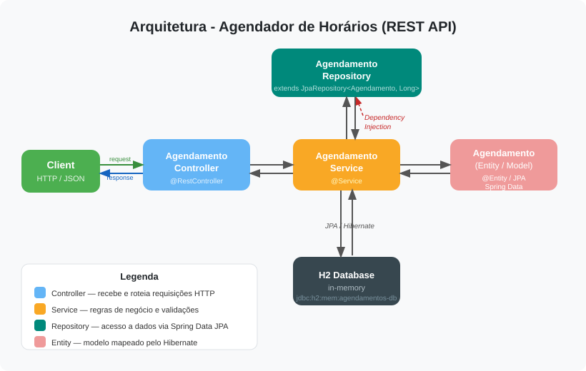

# Arquitetura Geral

## Visão Geral

O **Agendador de Horários** é uma API REST construída sobre o padrão de arquitetura em camadas (Layered Architecture), seguindo as convenções do Spring Boot. A aplicação permite criar, consultar, alterar e excluir agendamentos, com verificação de conflito de horário por serviço.

## Stack Tecnológica

| Camada              | Tecnologia                          |
|---------------------|-------------------------------------|
| Linguagem           | Java 25                             |
| Framework principal | Spring Boot 4.0.6                   |
| Web / REST          | Spring Web MVC                      |
| Persistência        | Spring Data JPA + Hibernate         |
| Banco de dados      | H2 (in-memory)                      |
| Redução boilerplate | Lombok                              |
| Documentação da API | SpringDoc OpenAPI 3.0.3 (Swagger)   |
| Contêiner           | Docker (multi-stage build)          |

## Diagrama de Arquitetura



## Diagrama de Camadas (texto)

```text
┌────────────────────────────────────┐
│           Cliente (HTTP)           │
└────────────────┬───────────────────┘
                 │ REST (JSON)
┌────────────────▼───────────────────┐
│         Controller Layer           │
│      AgendamentoController         │
│  GET / POST / PUT / DELETE         │
└────────────────┬───────────────────┘
                 │
┌────────────────▼───────────────────┐
│          Service Layer             │
│       AgendamentoService           │
│  Regras de negócio e validações    │
└────────────────┬───────────────────┘
                 │
┌────────────────▼───────────────────┐
│        Repository Layer            │
│     AgendamentoRepository          │
│  Spring Data JPA / Hibernate       │
└────────────────┬───────────────────┘
                 │
┌────────────────▼───────────────────┐
│         H2 In-Memory DB            │
│       Tabela: agendamento          │
└────────────────────────────────────┘
```

## Módulos / Pacotes

```text
com.issufibadji.agendador_horarios
│
├── AgendadorHorariosApplication.java   ← Entry point Spring Boot
│
├── controller/
│   └── AgendamentoController.java      ← Endpoints REST
│
├── infrastructure/
│   ├── entity/
│   │   └── Agendamento.java            ← Entidade JPA
│   └── repository/
│       └── AgendamentoRepository.java  ← Acesso a dados
│
└── services/
    └── AgendamentoService.java         ← Lógica de negócio
```

## Fluxo de Requisição

1. O cliente HTTP envia uma requisição para `/agendamentos`.
2. O **Controller** recebe e deserializa o JSON.
3. O **Service** aplica as regras de negócio (ex.: verificação de conflito).
4. O **Repository** executa a query no banco H2 via JPA.
5. A resposta percorre o caminho inverso até o cliente.

## Decisões Arquiteturais

|Decisão|Justificativa|
|---|---|
|H2 in-memory|Simplicidade para desenvolvimento/demo; sem necessidade de configuração externa de banco|
|Spring Data JPA|Elimina SQL manual; queries derivadas por convenção de nome|
|Lombok|Reduz código repetitivo (getters, setters, construtores)|
|SpringDoc/Swagger|Documentação interativa da API gerada automaticamente|
|Docker multi-stage|Build isolado; imagem final enxuta apenas com o JAR e JDK|
